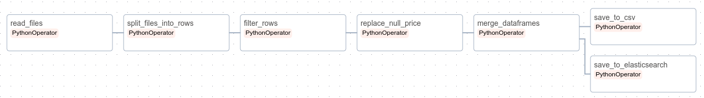
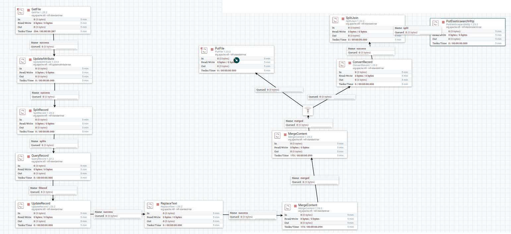
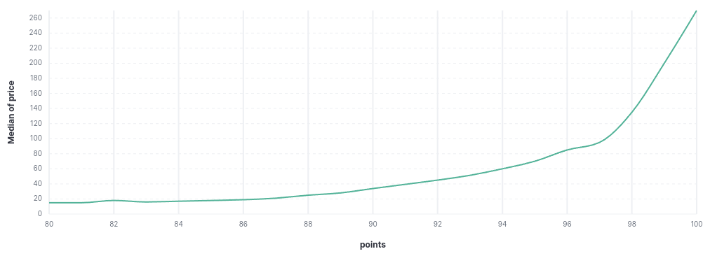

# Выполнил лабораторную работу студент группы 6231-010402D Павлов Владислав 
# Apache Airflow и Apache NiFi

## Apache Airflow

Исходные данные были помещены в определенную директорию контейнера Airflow. В каталоге "dags" находится главный файл DAG (main.py). Данный DAG состоит из нескольких блоков:
- основные импорты
- пути к исходным данным и итоговому CSV файлу
- блок функций, отвечающий за преобразование над CSV-файлами
- блок операторов с определенной последовательностью выполнения задач.

После завершения всех манипуляций с файлом "main.py", переходим в интерфейс Airflow, находим DAG с указанным названием в DAG - файле, активируем и запускаем, ожидая выполнения всех задач.
В результате получаем обработанный CSV файл с 75038 строками. Также преобразованный строки были отправлены в Elasticsearch, где выполняя определенные действия, мы получаем итоговую гистограмму зависимости стоимости напитка от баллов, выставленных дегустаторами.

### Схема пайплайна в Airflow 

### Проблемы
Основные проблемы возникли с подключением к Elasticsearch. Из-за неправильной обработки некоторых строк, например, отсутствия скобок  или пропуска знаков препинания, процесс останавливался на последнем этапе. Каждая проблема решалась по-разному: через манипуляции с кодом (переименования переменных, использование различным методов в библиотеках) и перезапуск компьютера.

## Apache Nifi 

Для выполнения работы данные были помещены в папку `data/lab1`, доступную для nifi. 

После запуска контейнеров, перейдя на адрес <http://localhost:18080/>, на схеме был построен пайплайн из процессоров, он представлен на рисунке ниже: 

Для реализации пайплайна были использованы следующие процессоры + параметры: 
- GetFile
  (./images/getfile.png)
- UpdateAttribute
  (./images/updateattribute.png)
- SplitRecord
  (./images/split_record.png)
- QueryRecord
  (./images/query_record.png)
- UpdateRecord
  (.lab1/images/query_record.png/images/update_record.png)
- ReplaceText
  (./images/replace_text.png)
- MergeContent (2 шт)
  (./images/merge_content.png) (./images/merge_content_2.png)
- PutFile
  (./images/put_file.png)
- ConvertRecord
  (./images/convert_record_json.png)
- SplitJson
  (./images/split_json.png)
- PutElasticsearchHttp
  (./images/split_json.png)

 - Добавлен процессор `UpdateAttribute` для корректного объединения всех файлов, чтобы присвоить каждому входному файлу одинаковое имя. 
Без этого пайплайн функционировал некорректно. 
 - Второй процессор `MergeContent` использовался для предотвращения переполнения памяти и обеспечения правильной записи в итоговый CSV-файл. 
Когда использовался только один процессор, возникало переполнение памяти, что приводило к нестабильной работе Nifi — либо система переставала работать,
либо в конечный файл записывалось разное количество строк в каждом запуске. Применялись различные вариации параметров процессоров и очередей, но это не помогало,
как и изменение времени ожидания пакета, что также не дало результатов. Однако опытным путем выяснилось, что добавление второго `MergeContent` устраняет эти проблемы.
У первого процессора были выставлены параметры для обработки большого числа пакетов с коротким временем ожидания, а у второго — для обработки небольшого количества
крупных пакетов с длительным ожиданием. В итоге, CSV-файл начал формироваться корректно, и количество строк стабильно совпадало при каждом запуске.
 - Процессоры `ConvertRecord` и `SplitJson` оказались необходимыми для успешного экспорта данных в Elasticsearch. 

### Основные проблемы, с которыми столкнулись при реализации. 

- Параметры процессоров и очередей, связанные с максимальным объемом пакетов, задержкой передачи и прочими аспектами, оказались сложными для настройки.
Документации "практически" не было, а информации по этой теме в интернете нашлось немного.

- Основные трудности возникали при настройке параметров процессоров. В первые этапы удавалось получить итоговый CSV-файл, но в нем для каждой строки записывались названия столбцов,
то есть при объединении данных заголовки полей добавлялись в каждую строку, что тоже попадало в итоговый файл. Проблему удалось решить с помощью процессора `ReplaceText`.
Позже возникла другая проблема с полем "price" — процессор `UpdateRecord` удалял строки, где значение "price" было None, вместо того чтобы заменять его на 0.0.
Решение было найдено эмпирическим путем, с использованием подбора подходящего регулярного выражения для обработки этого поля.
Постоянно возникала ошибка, когда количество записанных строк было меньше, чем обрабатывалось в реальности, что указывало на утечку данных.

- Контейнер Nifi также работал нестабильно: иногда он запускался, но при этом localhost не открывался.

## Apache Airflow 

Исходные данные csv-файлы были помещены в директорию `data/initial` контейнера Airflow. DAG-файл (`main.py`) находится в каталоге  

### Схема пайплайна в Airflow 

Проблем при реализации не возникло.

### График зависимости стоимости напитка к баллам поставленными дегустаторами

## Вывод: 

Apache nifi вызвал миллиард проблем. Аpache Airflow понравился в реализации, затрудней в реализации пайплайна не было.
