# Выполнил лабораторную работу студент группы 6231-010402D Павлов Владислав 
# Apache Airflow и Apache NiFi

## Apache Airflow

Исходные данные были помещены в определенную директорию контейнера Airflow. В каталоге "dags" находится главный файл DAG (main.py). Данный DAG состоит из нескольких блоков:
- основные импорты
- пути к исходным данным и итоговому CSV файлу
- блок функций, отвечающий за преобразование над CSV-файлами
- блок операторов с определенной последовательностью выполнения задач.

После завершения всех манипуляций с файлом "main.py", переходим в интерфейс Airflow, находим DAG с указанным названием в DAG - файле, активируем и запускаем, ожидая выполнения всех задач.
В результате получаем обработанный CSV файл с 75038 строками. Также преобразованный строки были отправлены в Elasticsearch, где выполняя определенные действия, мы получаем итоговую гистограмму зависимости стоимости напитка от баллов, выставленных дегустаторами.

### Схема пайплайна в Airflow 

### Проблемы
Основные проблемы возникли с подключением к Elasticsearch. Из-за неправильной обработки некоторых строк, например, отсутствия скобок  или пропуска знаков препинания, процесс останавливался на последнем этапе. Каждая проблема решалась по-разному: через манипуляции с кодом (переименования переменных, использование различным методов в библиотеках) и перезапуск компьютера.

## Apache Nifi 

Для выполнения работы данные были помещены в папку `data/lab1`, доступную для nifi. 

После запуска контейнеров, перейдя на адрес <http://localhost:18080/>, на схеме был построен пайплайн из процессоров, он представлен на рисунке ниже: 

Для реализации пайплайна были использованы следующие процессоры + параметры:

- GetFile
  
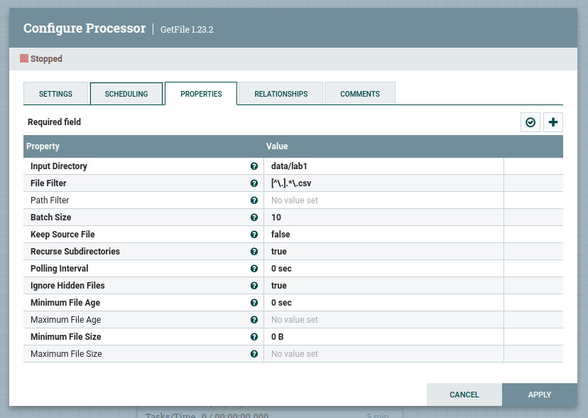

- UpdateAttribute

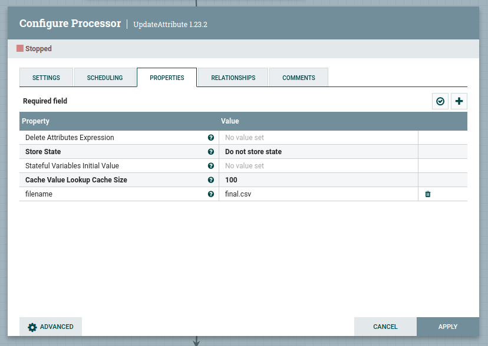

- SplitRecord

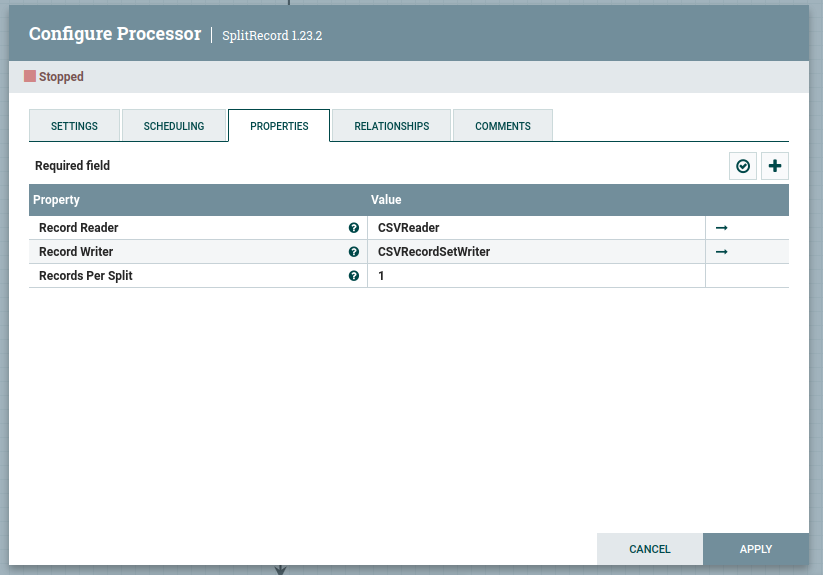

- QueryRecord
 
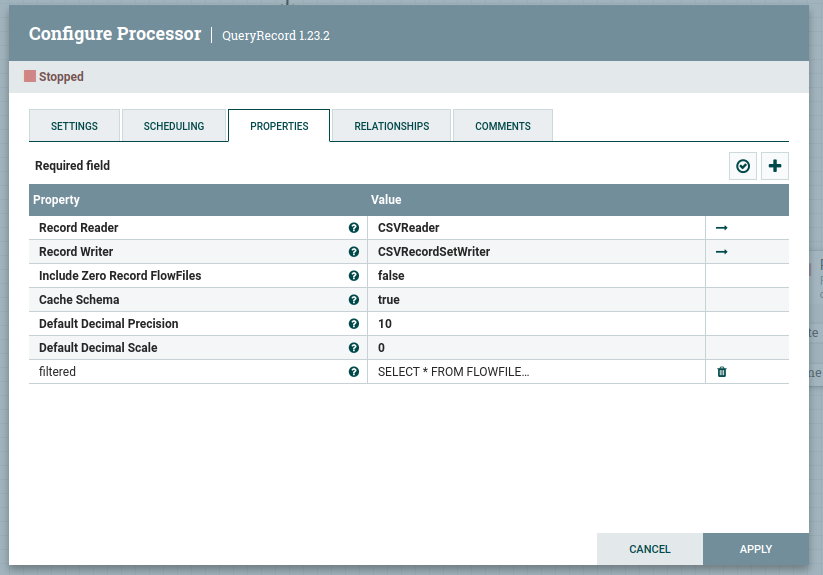

- UpdateRecord

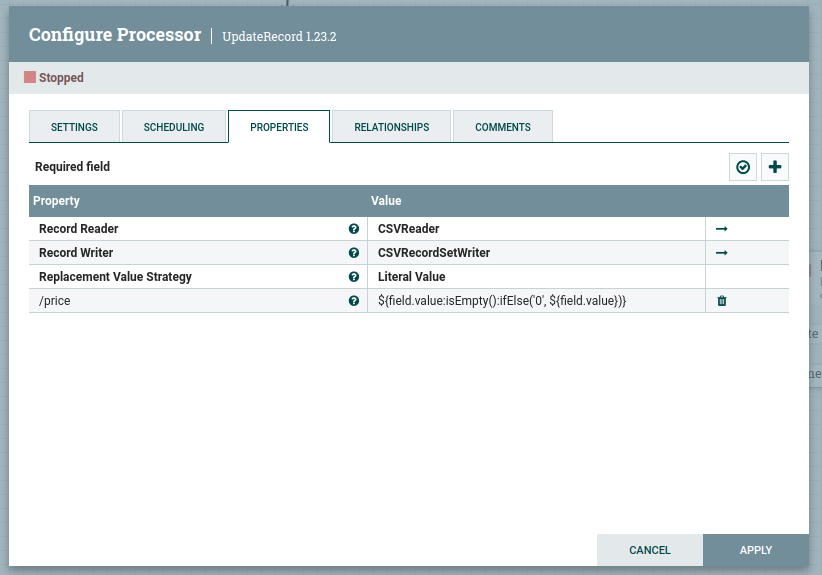

- ReplaceText

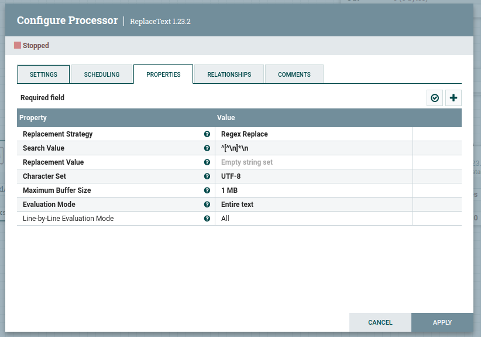

- MergeContentx2

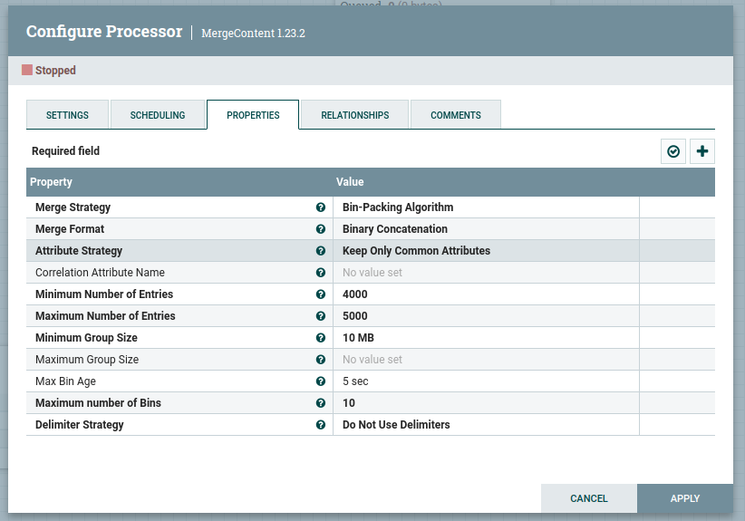

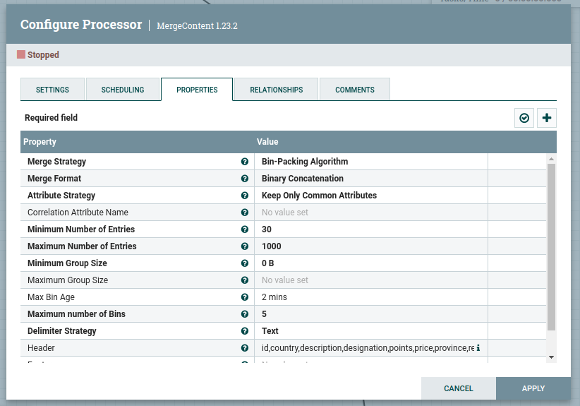

- PutFile

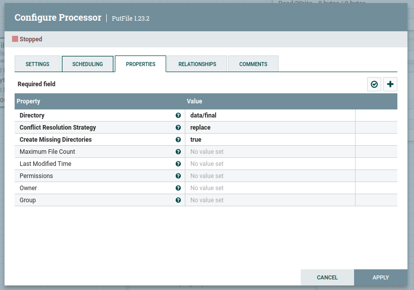

- ConvertRecord

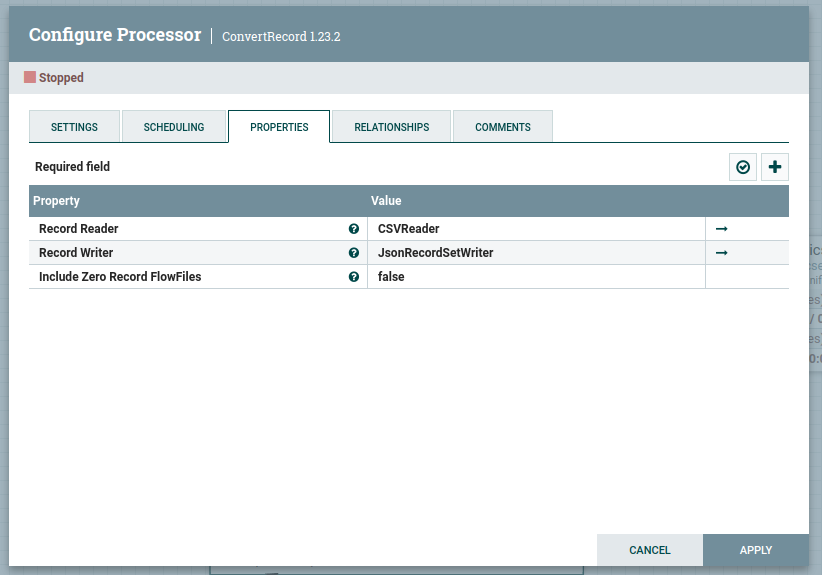

- SplitJson

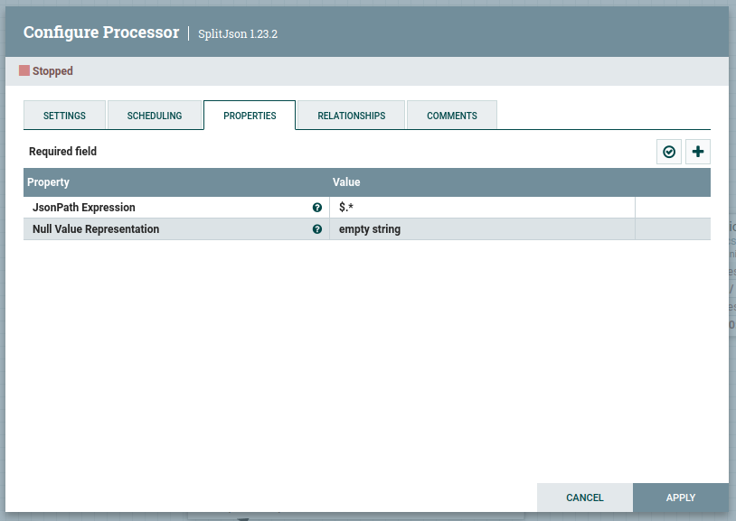

- PutElasticsearchHttp

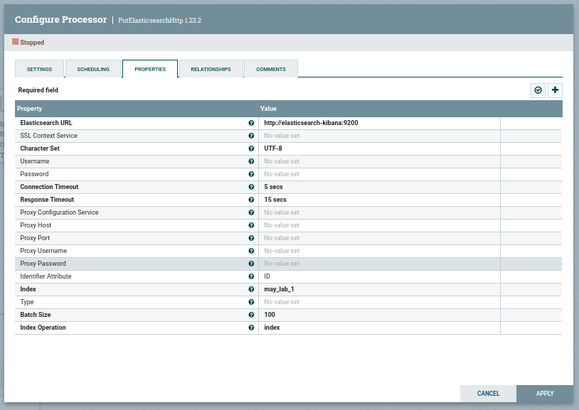

### Основные проблемы, с которыми столкнулись при реализации. 

- Get File

Возникли проблемы с параметром, отвечающим за сохранение файлов после загрузки в пайплайн, что привело к неверному количеству строк в итоговом файле.

- UpdateAttribute

Сначала данный процессор отсутствовал. Разобравшись с принципом работы пайплайна, файлы в итоговый файл передаются случайным образом без
слияния. Прописав наименование единого CSV-файла в параметрах данного процессора, поток стал формироваться с "единым названием".

- SplitRecord

Проблем с настройкой не возникло, однако были трудности с переполнением памяти.

- QueryRecord

После написания SQL-запроса все работало корректно.

- UpdateRecord

Возникли трудности с написанием правильной обработки строк, были протестированы несколько вариантов, и конечный вариант остался в итоговом коде.

- ReplaceText

После решения предыдущих проблем итоговый CSV-файл формировался с несколькими подряд строками-заголовками. Эта проблема была решена с помощью регулярного выражения.

- MergeContent (x2)

Первоначально был протестирован один процессор, но итоговый файл каждый раз перезаписывался, и количество строк было недостаточным. Увеличил емкость потока,
что почти решило проблему, но в итоге происходило зависание NiFi и вылет. Были предприняты попытки увеличить оперативную память и количество ядер процессора, однако
память продолжала переполняться из-за "переполнения корзины" внутри NiFi. Также увеличивал время ожидания, чтобы MergeContent накапливал нужное количество и выбрасывал.
В конце концов случайно обнаружил, что можно использовать два MergeContent подряд. Сначала было непонимание принципа работы, но, вспомнив о задержке и возможности указания
количества принимаемых файлов, мы настроили первый MergeContent на прием большого количества пакетов с небольшим временем ожидания, а второй — на прием небольшого
количества "больших" файлов с большим временем ожидания. В результате полученный CSV-файл имел необходимое количество строк.

- PutFile

Проблем не возникло.

- Elasticsearch

Проблемы возникли из-за незнания формата входящих файлов. Установил ConvertRecord и SplitJson, чтобы строки были разбиты по отдельности, и в Elasticsearch указал URL
с портом 9200. Дальнейшие действия были аналогичны тем, что выполнялись в Airflow.

- Контейнер Nifi также работал нестабильно: иногда он запускался, но при этом localhost не открывался.

### График зависимости стоимости напитка к баллам поставленными дегустаторами

## Вывод: 

Apache nifi вызвал много проблем. Аpache Airflow оказался в разы проще и быстрее как в понимании и написании DAG файла, так и в запуске и реализации всех задач.
